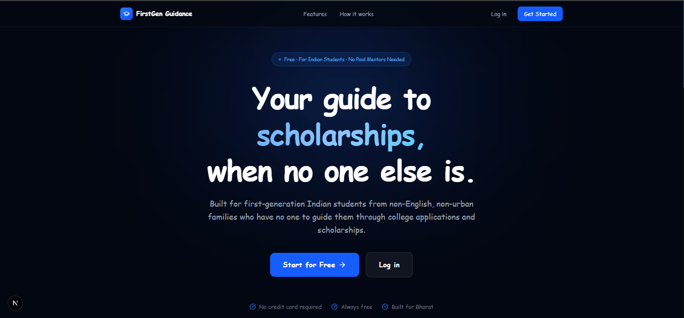
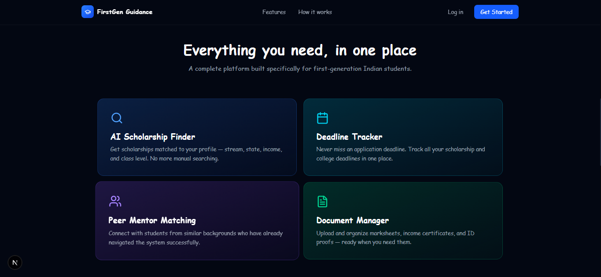
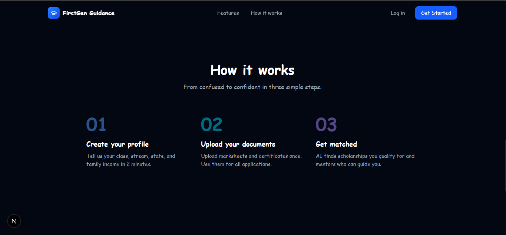
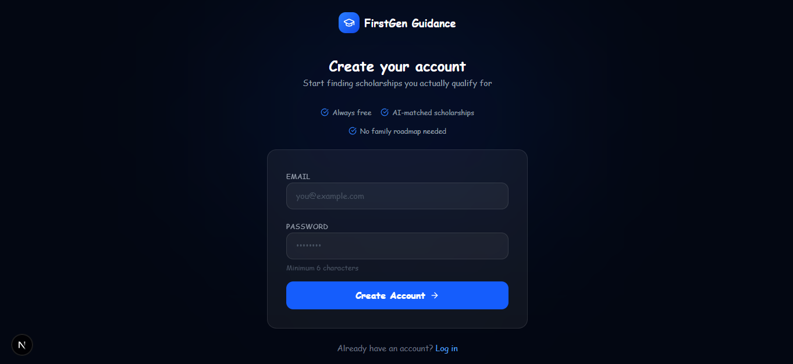
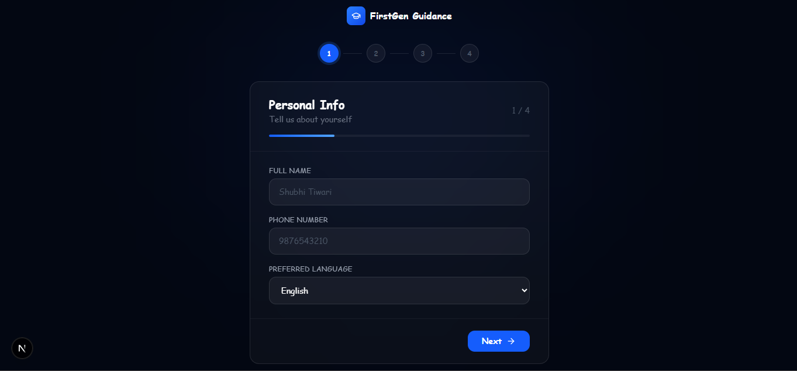
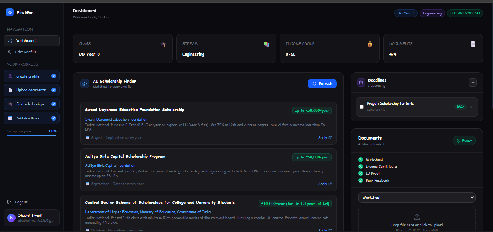
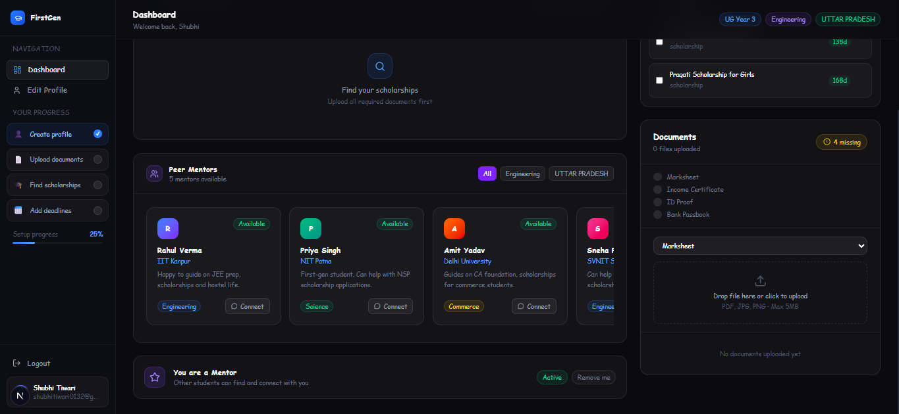
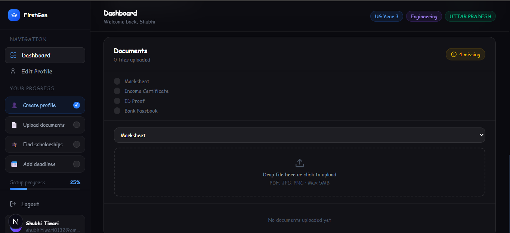
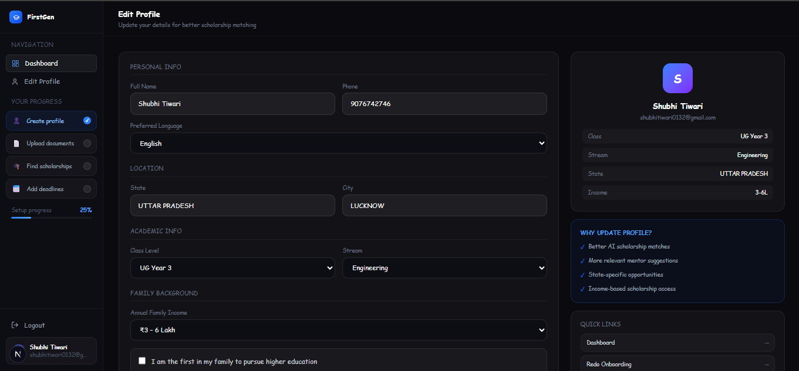

<div align="center">

# 🎓 FirstGen Guidance

### AI-powered scholarship & career guidance platform for first-generation Indian students

[](https://nextjs.org/)
[](https://www.typescriptlang.org/)
[](https://supabase.com/)
[](https://aistudio.google.com/)
[](https://first-gen-guidance.vercel.app)

**Live Demo → [first-gen-guidance.vercel.app](https://first-gen-guidance.vercel.app)**

</div>

---

## 🧩 The Problem

Students from non-English, non-urban families in India have **no one to guide them** through college applications, scholarships, or career decisions. Existing platforms are either US-focused, English-only, or require paid mentors.

> 600M+ Indians are first-generation learners. Most miss scholarships they qualify for — simply because no one told them.

---

## 📸 Screenshots

### Landing Page




### Auth & Onboarding



### Dashboard




### Profile


---

## ✅ What's Built

| Feature | Status |
|---|---|
| Email auth (signup / login) | ✅ Live |
| Multi-step onboarding (4 steps) | ✅ Live |
| Student profile saved to database | ✅ Live |
| AI scholarship finder (Gemini) | ✅ Live |
| Deadline tracker | ✅ Live |
| Peer mentor matching | ✅ Live |
| Become a mentor registration | ✅ Live |
| Document upload with checklist | ✅ Live |
| Profile edit page | ✅ Live |
| Modern dark UI with sidebar | ✅ Live |
| Deployment on Vercel | ✅ Live |

---

## 🗺️ Roadmap

| Feature | Status |
|---|---|
| Vernacular language UI (Hindi, Tamil...) | 📅 Planned |
| WhatsApp deadline notifications | 📅 Planned |
| State-wise scholarship database | 📅 Planned |
| Mobile app (React Native) | 📅 Planned |

---

## 🛠️ Tech Stack

| Layer | Technology |
|---|---|
| Frontend | Next.js 16, TypeScript, Tailwind CSS |
| Backend | Next.js API Routes |
| Database + Auth | Supabase (PostgreSQL + Row Level Security) |
| File Storage | Supabase Storage |
| AI | Google Gemini 2.0 Flash |
| Deployment | Vercel |

---

## 🚀 Getting Started

```bash
# Clone the repo
git clone https://github.com/shubhitiwariiii/first-gen-guidance.git
cd first-gen-guidance

# Install dependencies
npm install

# Set up environment variables
cp .env.example .env.local
# Fill in your Supabase and Gemini API keys

# Run locally
npm run dev
```

---

## 🔐 Environment Variables

Create a `.env.local` file:

NEXT_PUBLIC_SUPABASE_URL=your_supabase_project_url

NEXT_PUBLIC_SUPABASE_ANON_KEY=your_supabase_anon_key

GEMINI_API_KEY=your_gemini_api_key
---

## 🎯 Target Users

- Class 10–12 students from Tier 2/3 cities
- First-year UG students unaware of scholarship options
- Students from families with annual income below ₹6 LPA
- First-generation college goers with no guidance network

---

## 👩‍💻 Author

**Shubhi Tiwari**  
B.Tech CSE (AI & ML) — Galgotias College of Engineering & Technology

[](https://linkedin.com/in/shubhi-tiwari-664553329)
[](https://github.com/shubhitiwariiii)

---

<div align="center">
Built to solve a real problem. For the students who had no one to ask.
</div>